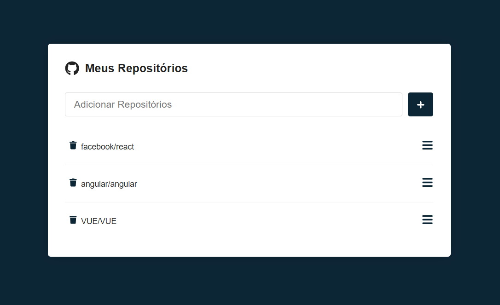

# GITHUB_API
<br>

</img>

<br>

Bem-vindo ao projeto GITHUB_API, projeto esse que consiste em possibilitar o usuário adicionar um repositório real, existente no github e poder ver as issues abertas neste repositório e verificar se as mesmas se encontram em estado aberta ou fechada.

<br>

## 📖 Índice
- [Instalação](#installation)
- [Tecnologias Utilizadas](#techs-used)
- [Desenvolvido](#team)

## Instalação <a name="installation"></a>
Para instalar o projeto, será necessário algum gerenciador de pacotes JavaScript (NPM, Yarn, PNPM, Bun...).

Primeiro, abra sua linha de comando e digite a seguinte linha:
```
git clone https://github.com/thenrybruno/github-api.git
```

E em seguida:
```
cd github-api
```

Já na root do projeto, baixe as dependências com o seu comando de instalação (com base no seu gerenciador de pacotes):

```
npm install

yarn install

bun install
```

## Tecnologias Utilizadas <a name="techs-used"></a>
- [Axios](https://www.npmjs.com/package/axios)
- [ESLint](https://eslint.org/)
- [React](https://react.dev/)
- [Vite](https://vitejs.dev/)
- [Styled-Components](https://styled-components.com/)

## Desenvolvido <a name="team"></a>

- [Bruno Almeida](https://github.com/thenrybruno)